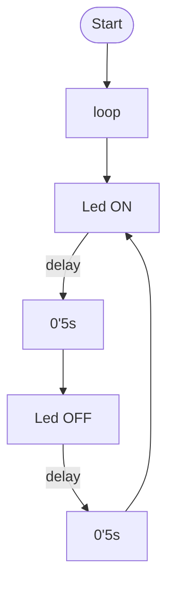

Laia Bombi Capdevila
*Grup 13*
# PRÀCTICA 1: Blink
___
##### Objectiu 
Fer parpadejar periòdicament un led controlat amb el microcontrolador ESP32
___
##### Codi

```
#include <Arduino.h>

void setup() {
  pinMode(LED_BUILTIN,OUTPUT);
  Serial.begin(115200);
}

void loop() {
  digitalWrite(LED_BUILTIN, HIGH);
  Serial.println("ON"); 
  delay(500);
  digitalWrite(LED_BUILTIN, LOW);
  Serial.println("OFF");
  delay(500); 
  Serial.println(LED_BUILTIN); 

}
```
___
##### Diagrama de flujo



___
##### Diagrama de tiempos


**¿Cuál es el tiempo libre que tiene el procesador?**
El temps lliure que té el processador és el temps que la CPU no està realitzant cap operació


 